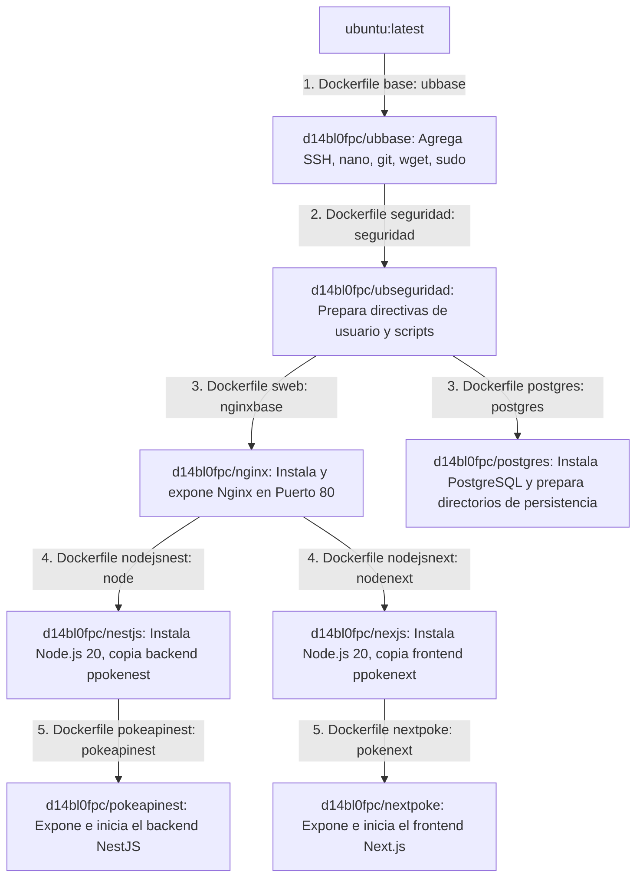

# Plan de Despliegue, Arquitectura y Alta Disponibilidad

Este documento detalla el plan informativo para corregir, desplegar y verificar el proyecto **Proyecto-Morgado** (NestJS + Next.js + PostgreSQL) en la VPS.

---

## 1. Plan Informativo de Cambios

### Diagnóstico de la VPS Actual
Tras realizar una inspección automatizada en la VPS (`178.238.233.205`), hemos verificado lo siguiente:
- **Sistema Operativo:** Ubuntu 24.04.4 LTS (Noble Numbat).
- **Herramientas de Contenedores:** Docker (`29.5.1`) y K3s (`v1.35.4+k3s1`) están correctamente instalados.
- **Helm:** Helm `v3.21.0` está instalado y activo.
- **Estado Actual del Cluster:**
  - Existe un namespace llamado `next-y-nest` con el despliegue anterior (basado en SQLite).
  - Existe una instalación del Chart de Helm `pokeapi-nest-next` en el namespace `default`.
  - Los pods de frontend (`webnext`) y backend (`webnest`) en el namespace `default` están en estado `Running`.
  - **Error Detectado:** El pod `stateful-postgres-0` está en estado **`Pending`** de manera indefinida.
  - **Causa Raíz:** El PersistentVolumeClaim (`data-stateful-postgres-0`) requiere la StorageClass `microk8s-hostpath`. Dado que la VPS ejecuta **K3s** y no MicroK8s, esta StorageClass no existe. La StorageClass disponible por defecto en K3s se llama **`local-path`**.

### Cambios a Realizar

#### A. En el Repositorio Local (Workspace)
1. **Modificar `values.yaml`:**
   - Ubicación: `Docker/Caronte/proyectos/personal/pokeapi-nest-next/values.yaml`
   - Cambio: Modificar `postgres.persistence.storageClassName` de `"microk8s-hostpath"` a `"local-path"`.
2. **Subir los cambios a GitHub:**
   - Hacer un commit de todo el directorio `Docker` (que está actualmente *untracked* en la rama `main`) y subirlo al repositorio `https://github.com/D14BL0-FPC/Proyecto-Morgado.git`.

#### B. En la VPS (Despliegue)
1. **Actualizar el archivo `values.yaml` in la VPS:**
   - Modificar `/opt/pokeapi-nest-next/values.yaml` cambiando la StorageClass a `local-path`.
2. **Actualizar el despliegue de Helm:**
   - Ejecutar `helm upgrade pokeapi-nest-next /opt/pokeapi-nest-next` en el namespace `default`.
3. **Verificar Estado del Cluster:**
   - Validar que `stateful-postgres-0` pase a estado `Running` tras recibir el volumen correcto.

---

## 2. Explicación Técnica Requerida

### 2.1 Estructura de los Dockerfiles
El proyecto utiliza una estructura de imágenes heredada muy interesante y jerárquica para mantener la uniformidad del sistema operativo base, añadir herramientas de red, ssh y dependencias específicas. La cadena de herencia es la siguiente:

- **Aislamiento y jerarquía:** Cada capa de infraestructura (SSH/Herramientas de red -> Configuración de usuarios -> Servidor Web -> Entorno Node.js -> Aplicación final) se empaqueta en una imagen reutilizable.
- **Entrypoints robustos:** Cada contenedor hereda scripts de inicio `/root/admin/.../start.sh` para levantar los servicios necesarios de manera dinámica y mantener el contenedor activo.

### 2.2 Manifiestos de Helm para Kubernetes
El Chart de Helm en `Docker/Caronte/proyectos/personal/pokeapi-nest-next` organiza y despliega todos los componentes en Kubernetes:
- **`stateful_postgres.yml`:** Un **StatefulSet** para PostgreSQL con 2 réplicas. El uso de StatefulSet en lugar de Deployment es una excelente práctica para bases de datos relacionales, ya que asigna una identidad única y persistente a cada pod (ej. `stateful-postgres-0`), gestionando volúmenes dedicados de manera determinista.
- **`deploypokeapi.yml` & `deploynextpoke.yml`:** Deployments para NestJS (`webnest`) y Next.js (`webnext`). Tienen configuradas **3 réplicas** en `values.yaml` para garantizar **alta disponibilidad (HA)**.
- **`servicepokeapi.yml`, `servicenextpoke.yml` y `service_postgres.yml`:** Exponen los pods internamente en la red del cluster. Los servicios de la app web usan puertos específicos (`3000` y `80`), mapeando puertos NodePort para SSH alternativo si se requiere depuración.
- **`ingresspokeapi.yml` & `ingressnextpoke.yml`:** Usan el Traefik Ingress Controller instalado en K3s para enrutar peticiones basadas en el host (`nesthelm.davidsegurarodriguez.com` y `nexthelm.davidsegurarodriguez.com`) hacia los servicios de backend y frontend.
- **`secret_postgres.yml` & `configmappostgres.yml`:** Guardan las credenciales y la configuración de red de la base de datos de manera desacoplada.

### 2.3 Verificación de Alta Disponibilidad
Para demostrar que si se destruye un pod la web no cae:
1. Mantendremos un bucle de peticiones HTTP constante al frontend `nexthelm.davidsegurarodriguez.com`.
2. Ejecutaremos `kubectl delete pod <nombre-de-un-pod-webnext> --now` para destruirlo instantáneamente.
3. Observaremos que las peticiones continúan recibiendo respuesta `200 OK` sin interrupciones ni latencia perceptible, gracias al balanceo automático de los endpoints del Service hacia las réplicas restantes.
4. Kubernetes levantará un pod de reemplazo de inmediato para volver a la cantidad deseada de 3 réplicas.
